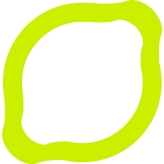

Trochę o mnie
**************

Paweł Kopka
============

- Ukończyłem Wydział Fizyki na UW
- Pracuję w Codilime
- PyConPL Hat-trick

Zajmuje się
===============

- sieciami
- SDNy
- chmurami

Kiedyś
---------

- miałem rybki
- próbowałem założyć zespół punkowy

Teraz
---------

- szukam ekipy remontowej w Warszawie i okolicach
- pracuje z Ansiblem

Kontakt
----------
https://github.com/pawelkopka

