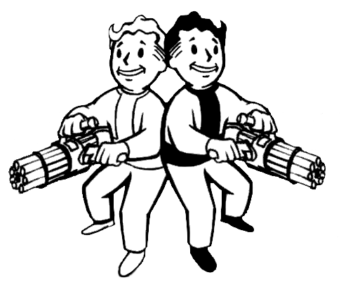

Team spirit
***********************

Marian lubi pracę zespołową i czuje team spirit. Dlatego korzysta z git i nie dzieli się kodem przy użyciu pendriva,
ale że lubi kolorki w terminal dlatego ma używa git-prompt.

Rola: Git
=================

Templates
---------
.. literalinclude:: ../../playbooks/roles/git/templates/gitconfig.j2

Files
---------
.. literalinclude:: ../../playbooks/roles/git/files/git-prompt-colors.sh

Tasks
---------
.. literalinclude:: ../../playbooks/roles/git/tasks/main.yml

Output
--------
.. code-block:: sh

.. note::

   Template pozwala generowanie plików, konfigów na podstawie zmienny. `template`_

.. _template: https://docs.ansible.com/ansible/latest/modules/template_module.html