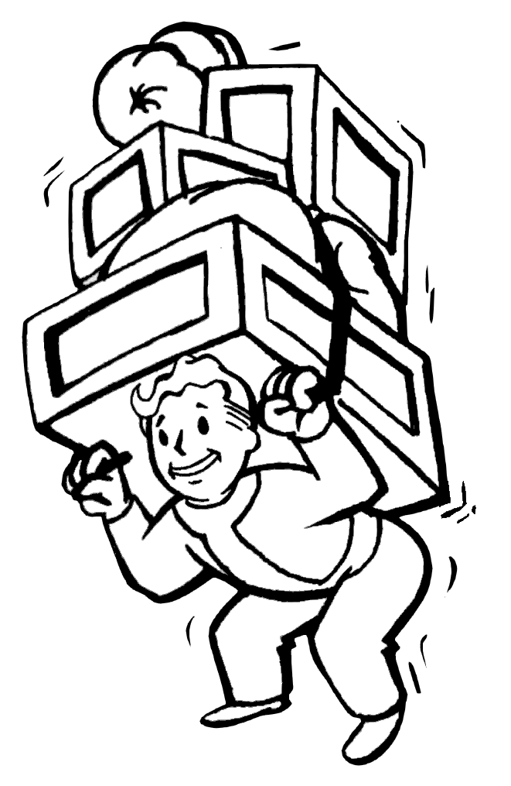

Budowniczy
***********************

Marian czasem się ludzie w różnych projektch, czasem coś na konferencje, a czasem pisz coś swojego.
Dlatego ma list repozytoriów na których pracuje.

Rola: Projects
=================

Tasks
---------
.. literalinclude:: ../../playbooks/roles/projects/tasks/main.yml

Output
--------
.. code-block:: sh

   $ ansible-playbook playbooks/projects.yml

   PLAY [pull projects] ***************************************************************************************************************************************************************************************

   TASK [Gathering Facts] *************************************************************************************************************************************************************************************
   ok: [localhost]

   TASK [projects : Ensures /home/kepok/projects dir exists] **************************************************************************************************************************************************
   ok: [localhost]

   TASK [projects : pull projects] ****************************************************************************************************************************************************************************
   changed: [localhost] => (item=https://github.com/pawelkopka/workplace)
   changed: [localhost] => (item=https://github.com/pawelkopka/SimpleMonitoring)

   PLAY RECAP *************************************************************************************************************************************************************************************************
   localhost                  : ok=3    changed=1    unreachable=0    failed=0

.. note::

   Git pozwala na zarzącanie repozytoriami `git`_

.. _git: https://docs.ansible.com/ansible/latest/modules/git_module.html